Logic Santos Valley
===

Logic Santos Valley is a 3D action-adventure video game developed in Java using the [jMonkeyEngine](https://jmonkeyengine.org/) library. The game location is set in the state of California and offers the player the ability to freely move around the fictional city of Logic Santos. Online gameplay is also supported!\
This project was developed in the context of the *Graphical Interfaces and Event-Oriented Programming* course during the bachelor's degree in Computer Science.

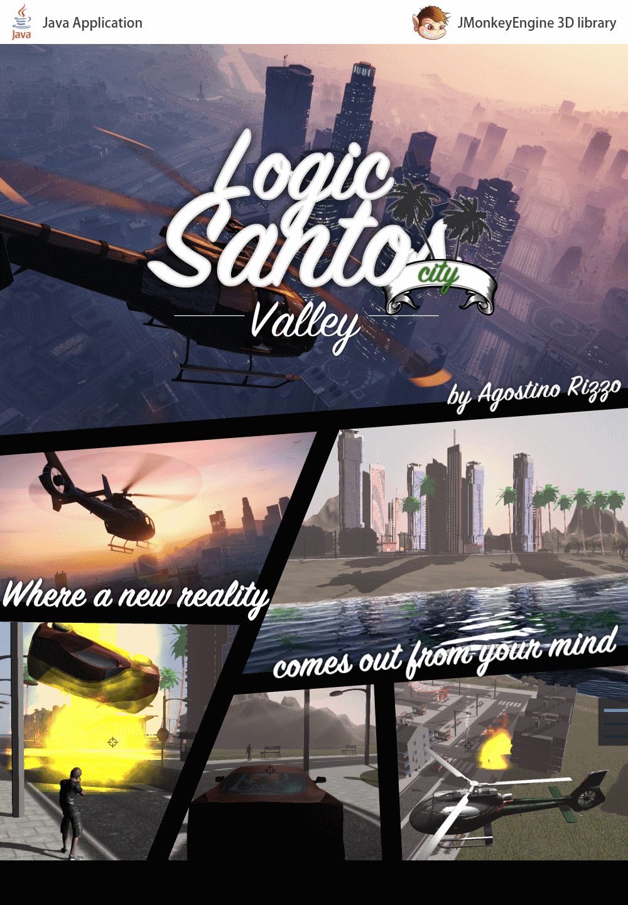

As a third-person game (or first-person with appropriate settings), it is set in a completely open world. The player can perform combos in combat, punches and kicks, use firearms and explosives to fight enemies; he can also run, jump, use vehicles to travel around the game world. The main objective of the game is to complete missions to advance the story; much like other open-world games, these missions can be completed at the player's discretion. If the player commits illegal acts during gameplay, the game's law enforcement agencies may respond. These are represented by stars displayed in the top right corner of the screen. For example, if you have 4 stars, the police will become very aggressive, and it will be more difficult for the player to outrun the police than if you have 1 star only.
The game map is very large and includes beaches, coasts, countryside, wilderness areas and the city center.

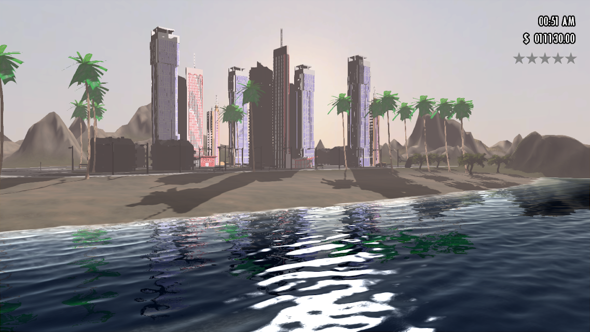

The game is essentially divided into two modes:
* **Roaming**. Allows the player to freely explore the city and directly interact with it: he can run, jump, shoot, steal and drive vehicles, use aircraft to explore the city from above and move around faster;
* **Career**. Allows the player to improve his status by completing missions. There are a certain number of different missions available to complete: each mission has a name, description, difficulty level, and a certain dollar earning threshold. The player's goal is to take and complete the available missions, thus maximizing their earnings. However, it is also possible to earn a few dollars from individual actions performed by the player (e.g., shooting using explosives, etc.). The missions will require to perform illegal acts, which trigger the intervention of the game's law enforcement officers. Another objective is to outrun the police by completing the missions. The police intervenes according to five different levels of *aggressiveness*. This is represented by stars in the top right corner. Stars will be activated when the player commits illegal acts, in a number equal to the level of illegality. Stars will increase if the player continues to commit further illegal acts. When police intervention is active, officers will appear at different locations on the map: they will use strategies, taking routes that will allow them to reach the player (or players during online gameplay) in the shortest possible time, thus countering their activity.

The city center is inspired by the urban centers of classic Californian cities. It features pedestrians wandering the city and the hillside streets, as well as vehicles and aircraft. The latter can be stolen by the player, who then takes control of them to move faster around the map, or to observe and attack enemies from above.

<table>
    <tr>
        <td>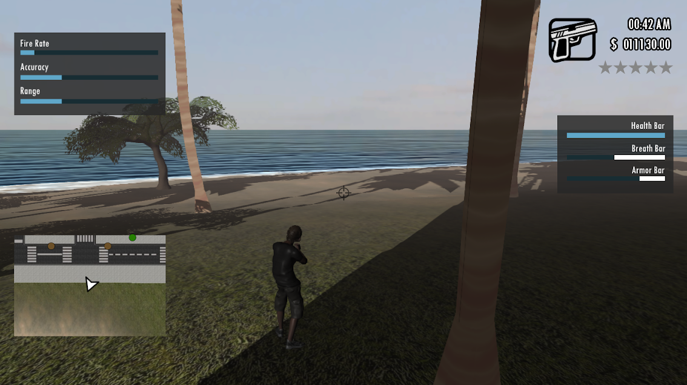</td>
        <td>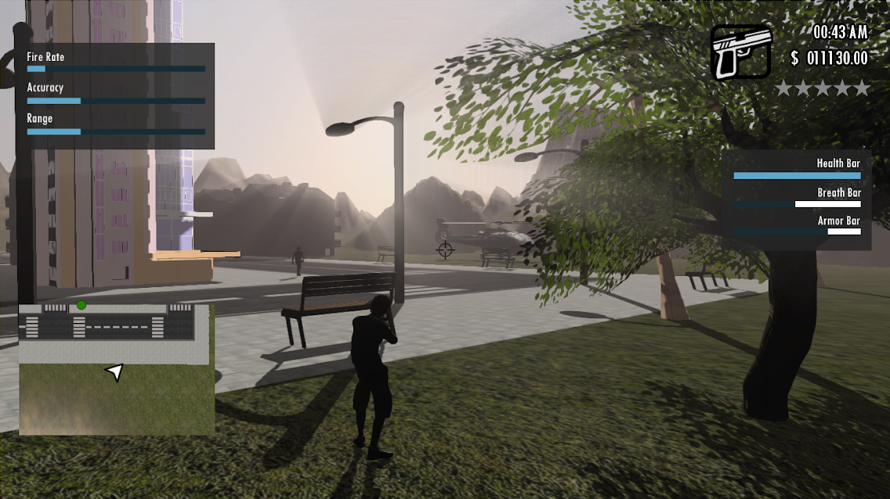</td>
        <td>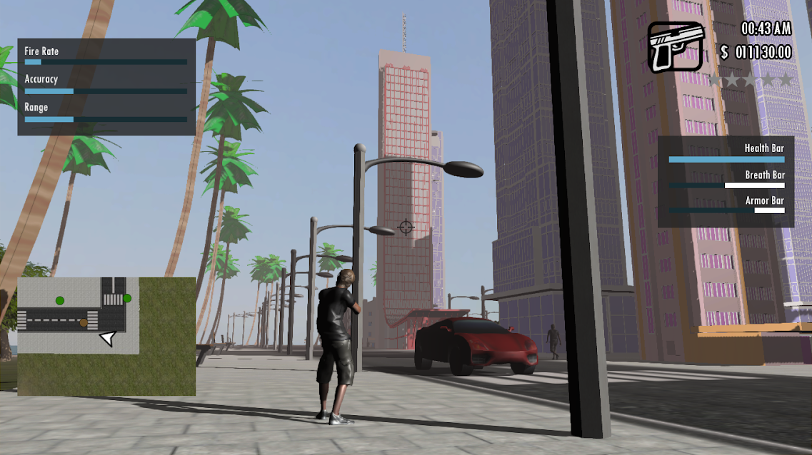</td>
    </tr>
    <tr>
        <td>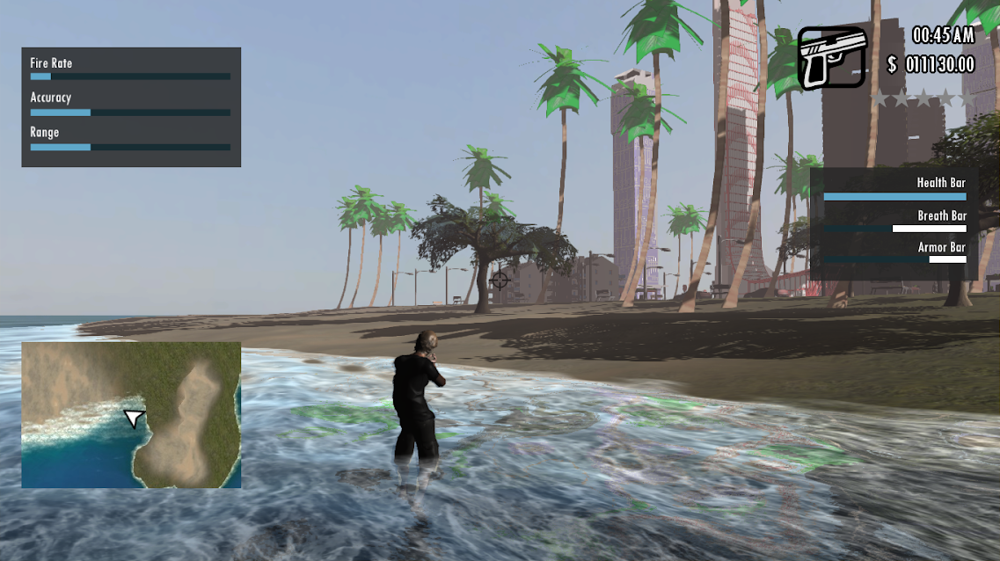</td>
        <td>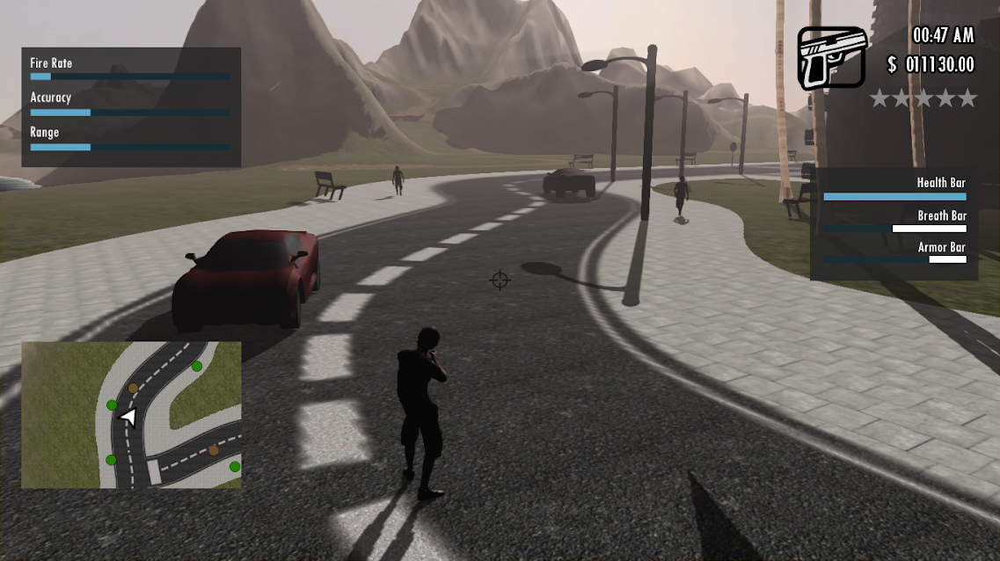</td>
        <td>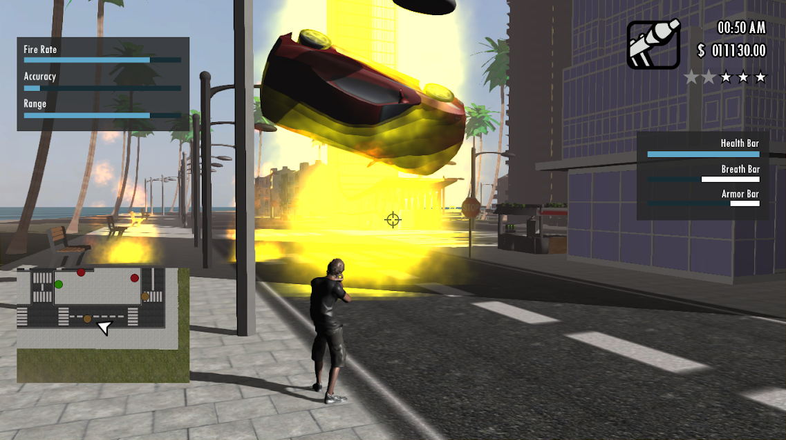</td>
    </tr>
    <tr>
        <td></td>
        <td>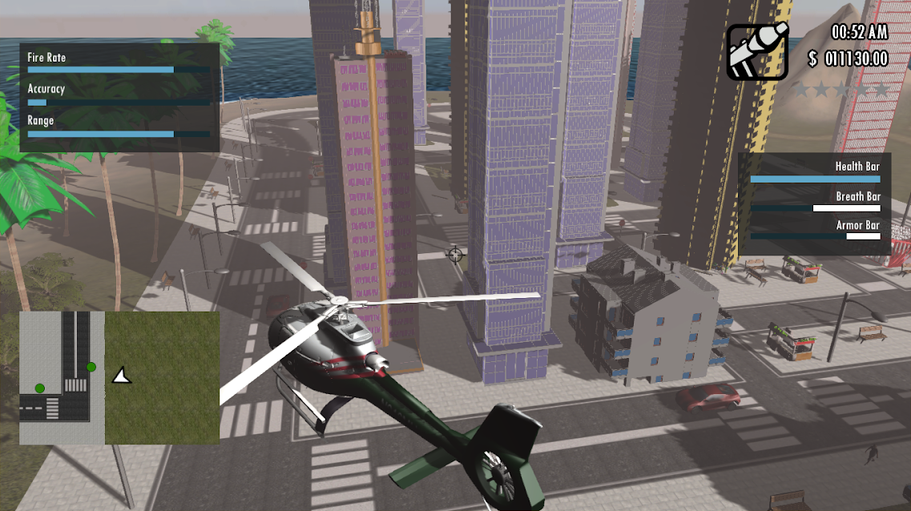</td>
        <td>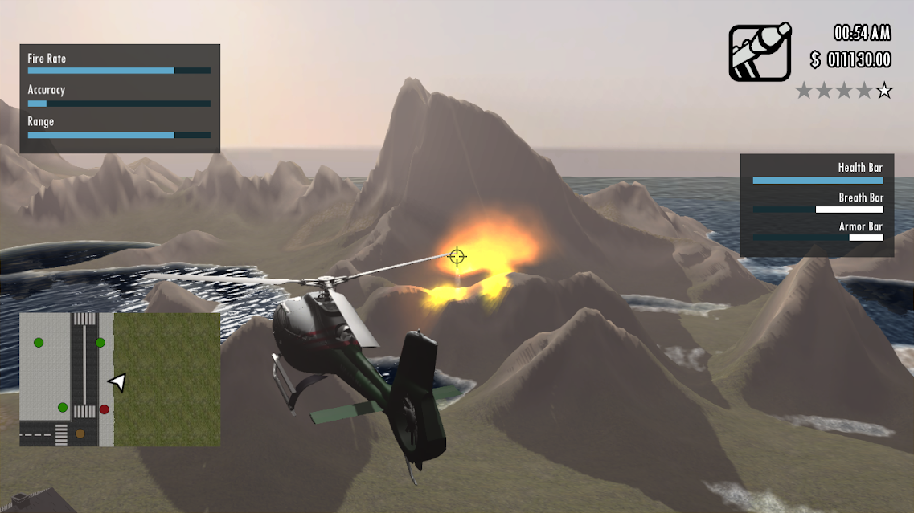</td>
    </tr>
</table>


## Usage
*   As a prerequisite, install the [jMonkeyEngine SDK](https://github.com/jMonkeyEngine/sdk/releases) (Java Virtual Machine v8 or higher is required). Use the [wiki](https://wiki.jmonkeyengine.org/docs/3.8/documentation.html) to find the installation guide and tutorials.\
*   Clone the game repository via:

    ```
    git clone https://github.com/AgostinoRizzo/logic-santos.git
    cd logic-santos
    ```

*   Download the [`Assets.zip`](mailto:agostino.rizzo@outlook.com) archive and extract it obtaining the new `logic-santos/Assets` directory.
*   Start the Java application via:

    ```
    java it.unical.logic_santos.gui.application.LogicSantosApplication
    ```

    *Use the main class* `it.unical.logic_santos.editor.application.LogicSantosEditorApplication` *to start the game editor.*


## UML Design

Below is a **use case diagram** (and a **domain model**) that helps illustrate the use case names and actors of the game, as well as the relationships between them. As you can see from the diagram, the game is made up of a multitude of different human (Player, Remote Player, Designer) and artificial (Policeman, Walker, Vehicle) actors.

<table>
    <tr>
        <td>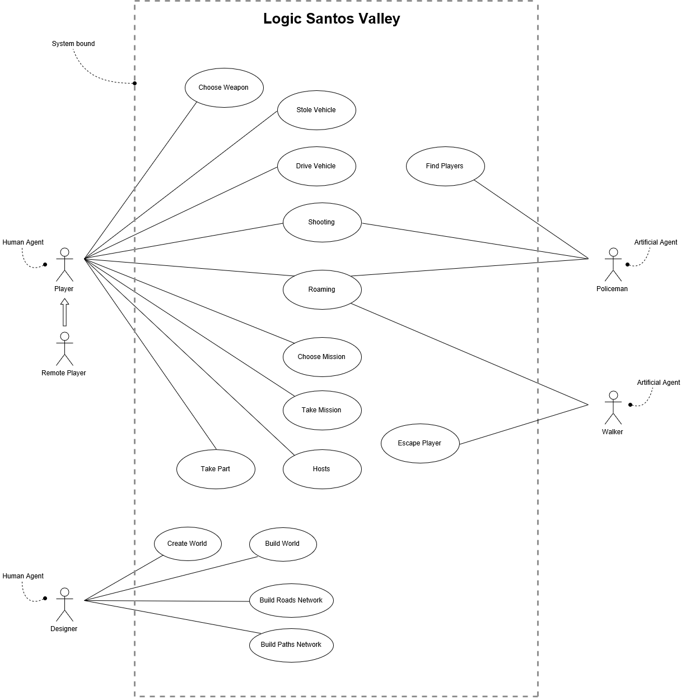</td>
        <td>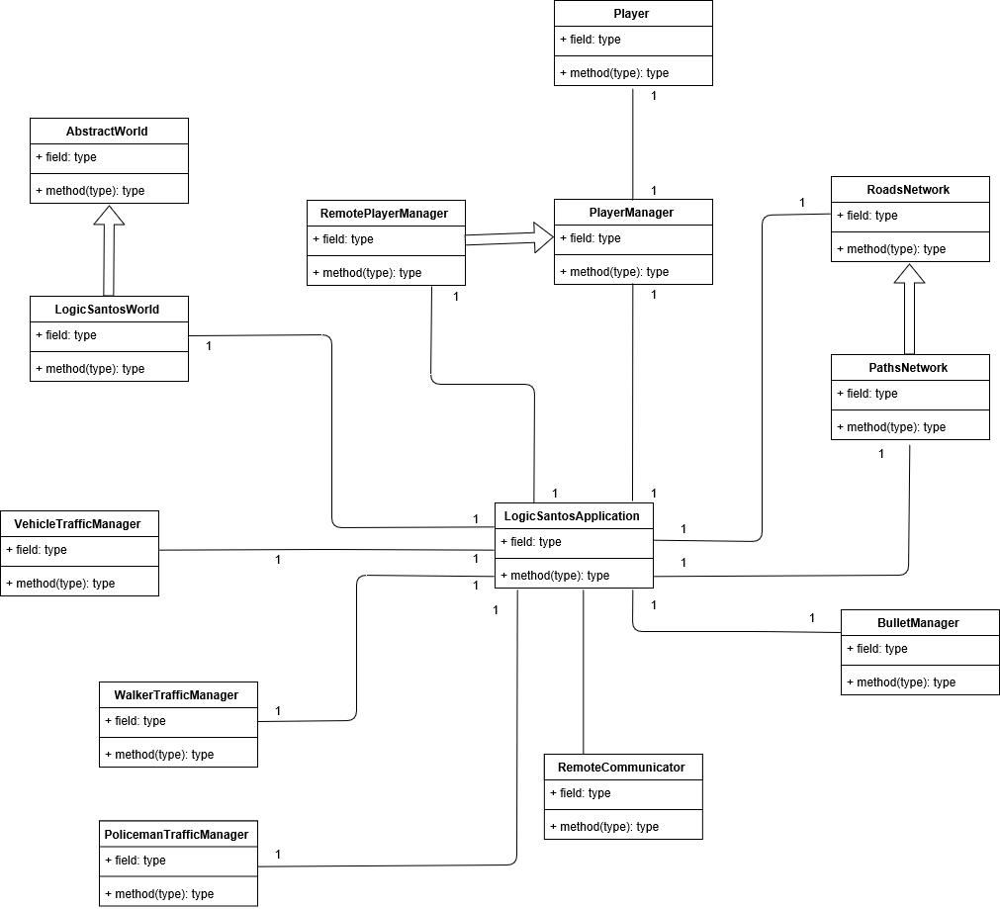</td>
    </tr>
</table>


## Design and Implementation Issues

### Collision Detection Engine
#### Spatial Hashing
Object collision management in the world has been designed and implemented using the **spatial-hashing** technique. This allows for less complex and therefore more efficient management than a *naive* collision-checking method (referring to the algorithm that provides collision checking with quadratic complexity in the number of objects). The used technique is based on the following trivial but important observation: *distant* objects have a low probability of colliding, while *close* ones have a high probability of colliding. From this, it can be deduced that the *naive* collision-checking method ignores this observation, which can be exploited for a more efficient management. The use of an algorithm (and appropriate data structures), that makes use of the current position of the objects and the space they occupy, allows for a significant reduction in the number of collision checks between distinct pairs of such objects.

The entire game platform (arena) is divided according to a grid (**hash table**). Each cell (**bucket**) represents a portion of space. All objects are mapped into this structure based on their position and the space they occupy. This mapping is obtained by a **hash function** defined as follows.\
Let `O` be a generic object in the world, and let `AABB(O)` be the (axes aligned) bounding box that defines its maximal physical extension. Let `P(O)` also be its position. Then:
* `AABB(O)` and `P(O)` are the inputs to the hash function;
* The hash function calculates a key that identifies the set of buckets (cells), of the hash table, occupied by the object;
* Object `O` is inserted into the buckets identified in the previous step.\
Note that each bucket is a one-dimensional structure (array) and can contain multiple objects: an object can occupy multiple cells (buckets) and therefore exist in more than one bucket at a given time. The collision engine has been implemented according to what has been described. Here is a graphical representation of the engine's state at a certain instant of time.

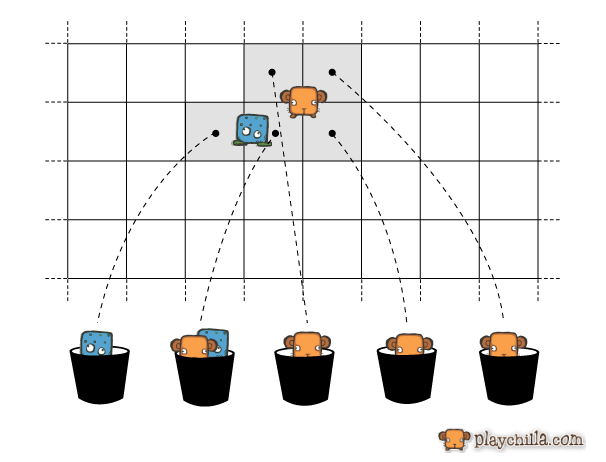

The collision engine is also continuously updated to remap objects that have moved. Also note that, objects that have:
* no common bucket, cannot collide and therefore the collision checking can be ignored;
* at least one common bucket, are potentially colliding and therefore must be checked for collisions.

The spatial hashing technique was also used during the game map editing.


## Non-Player Characters (NPCs)

### Road Network
#### Vehicle Driving
One of the artificial agents present in the game are vehicles. During gameplay, these will move along the entire road network of the city. The road network was modeled using specific algorithms and data structures allowing vehicles to follow routes moving from one part of the city to another.\
Specifically, the road network was modeled using **directed graphs** where different algorithms are used, for example, to identify the shortest paths. Information about the modeling (graph) and the calculated solutions allows vehicles to autonomously navigate the routes. The game editor also features the creation and, in general, modification of the logical representation of the road network.\
Below are some screenshots of the game editor during the construction (editing) phase of such network (in green).

<table>
    <tr>
        <td>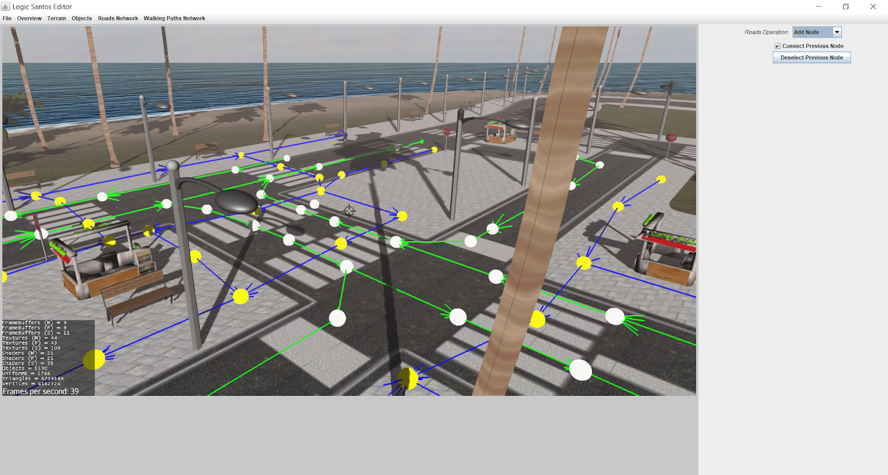</td>
        <td>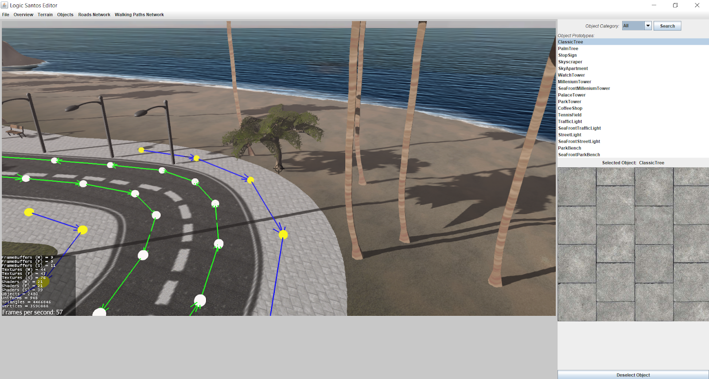</td>
        <td>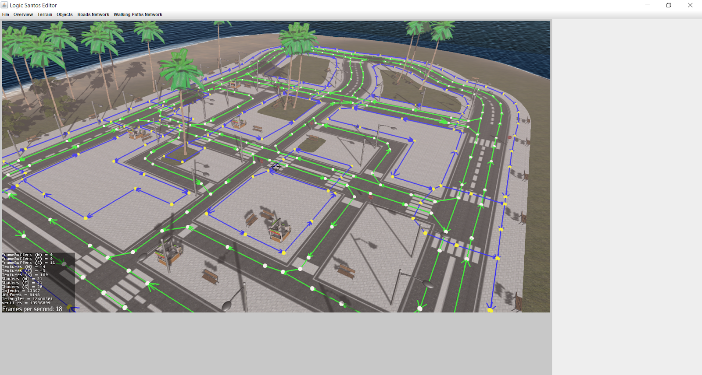</td>
    </tr>
</table>


### Path Network
#### Moving of human NPCs (Walkers, Policemen, etc.)
There are also human artificial agents present in the game that bring the city to life, such as **walkers**, **policemen**, etc. These will move throughout the entire pedestrian network during gameplay. The pedestrian network was modeled using specific algorithms and data structures to allow, for example, walkers to move along predefined paths bringing them from one part of the city to another.\
Specifically, the pedestrian network was modeled using **graphs** on which algorithms are run to identify, for example, the shortest paths used by policemen to reach the player(s) in the shortest time possible. Information about the modeling (graph) and the calculated solutions allows walkers and policemen to autonomously identify and execute routes. The game editor also features the creation and, in general, modification of the logical representation of the pedestrian network.\
Below is a screenshot of the game editor during the construction (or editing) phase of the network (in blue).

<table>
    <tr>
        <td>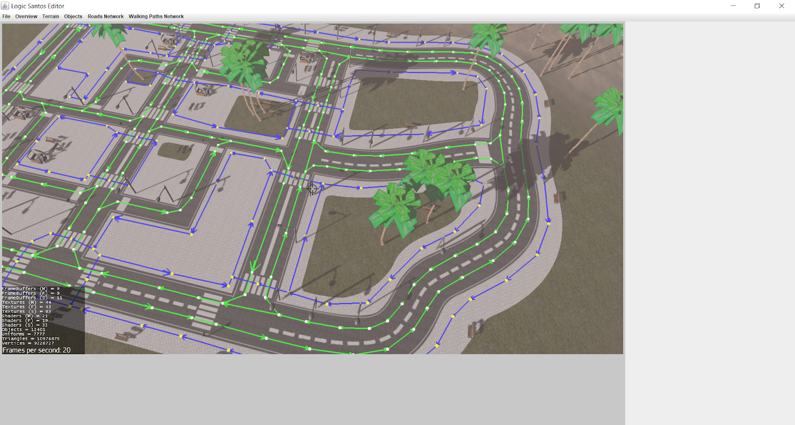</td>
        <td>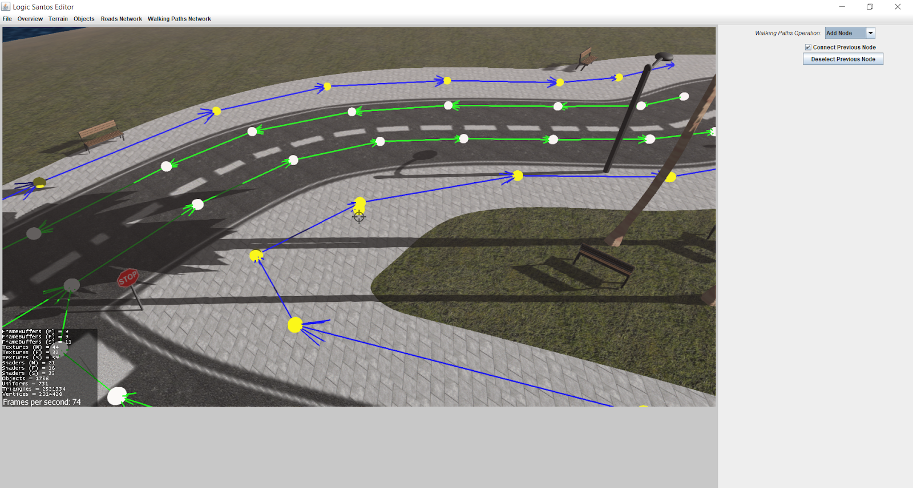</td>
    </tr>
</table>

Note how the pedestrian network can cover any sector of the entire game map. This will allow human NPCs to reach every corner of the entire territory (e.g. a policeman can effectively locate the player). The physical activity of the human NPCs will therefore use the presence of the pedestrian network model as a reference structure for their movements.\
Below is a screenshot illustrating the possible movements of walkers (green indicators in the minimap) along the entire pedestrian network built using the game editor.

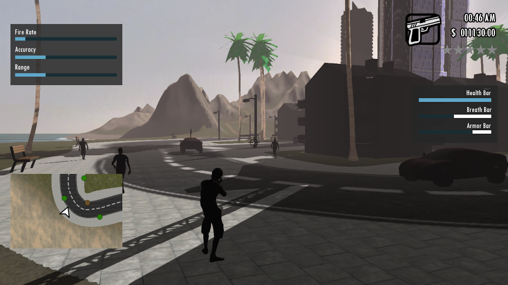


## AI

### Police System
The game offers the player(s) a direct and spontaneous interaction with the world around, similar to **open-world** games. The player can perform combos in combat, punches and kicks, use firearms and explosives to fight enemies, run, jump, and use vehicles to travel around the world. In case of illegal acts during gameplay, the game's law enforcement agencies can respond. These are triggered by stars in the top right corner of the screen. For example, if you have 4 out of 5 stars, the police's effort will become very aggressive, and it will be more difficult for the player to outrun the police than if you have only 1 star. An additional objective for the player is to outrun the police by completing missions. The police intervene according to 5 different levels of *aggressiveness*, represented by the activated stars in the top right corner. Stars will be activated when the player commits illegal acts, in a number equal to the level of illegality. Stars will increase if the player continues to commit further illegal acts. When police intervention is active, officers will appear at various locations on the map: they will use strategies, creating routes that will allow them to reach the player(s) as quick as possible, thus countering his activity.\
The **police system** is the game's most important artificial intelligence system. It does not only manage a clever placement of policemen across the map, but it also allows each of them to reason and move efficiently to reach the player(s) whenever appropriate. The policeman's reasoning, to counter the actions of the player(s), is based on the presence of the pedestrian network (described above), to identify landmarks and calculate the **lowest-cost** routes for any necessary movement.

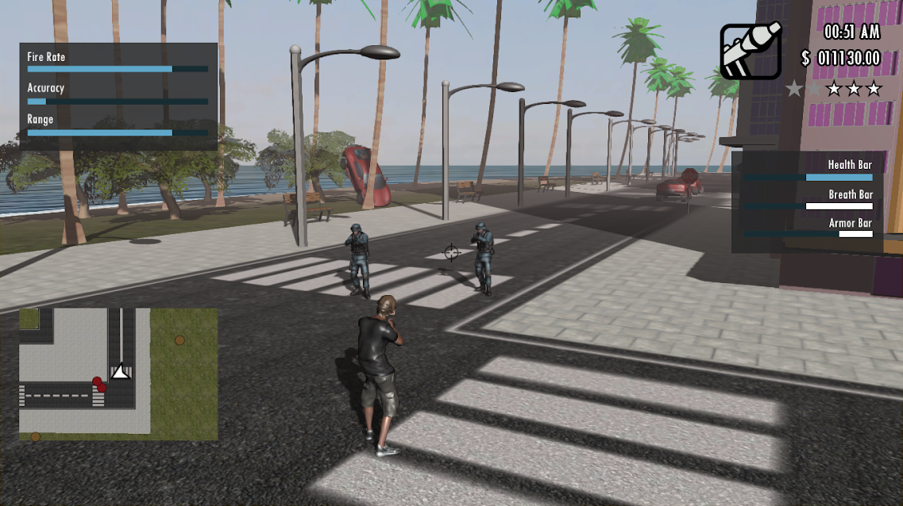

The management of the police system has been implemented according to the appropriate measures described below, affecting the following Java packages:
* `it.unical.logic_santos.ai`;
* `it.unical.logic_santos.traffic`.

The `it.unical.logic_santos.ai` package defines interfaces, abstract and concrete classes that allow the programmer to model the reasoning needed by a policeman to intervene and counter the actions of the player(s).

#### Available interfaces
* `IAgent` defines the behavior of a generic AI agent operating in the game environment;
* `IReasoning` defines a generic reasoning process that can be performed by an `AIgent`.

#### Implementations
* `PolicemanAgent` is a concrete implementation of a policeman's behavior;
* `ThreadBasedReasoning` is an **abstract** implementation of a generic reasoning process based on the use of **multi-threading**; the reasoning process is executed in parallel, avoiding, for example, to overload the game's main loop;
* `PathFinderReasoning` is a concrete class that extends the abstract `ThreadBasedReasoning` class; it represents reasoning that can be performed by the policeman to identify, based on the position of the player(s) and the structure of the pedestrian network, the **paths** to reach the player(s);
* `OptimizedPathFinderReasoning` is a concrete class that extends the abstract `ThreadBasedReasoning` class; it represents reasoning that can be performed by the policeman to identify, based on the position of the player(s) and the structure of the pedestrian network, the **shortest (optimized) paths** to reach the player(s).


The `it.unical.logic_santos.ai` package was designed to offer a particularly dynamic approach to the selection of different reasoning types that can be used by a generic policeman. This allows the application to **dynamically change** the behavior of the various policemen, making the behaviors themselves **polymorphic**. It will also be possible to extend the interfaces described above to dynamically add new reasoning and/or different **`PathFinder`** implementations.

The `it.unical.logic_santos.traffic` package handles the modeling of policeman' traffic management: dynamic distribution of policemen across the map; their update and intelligence (see **`PathFinder`**); any communication with other game components.


## Missions

### Mission System
The game is essentially divided into two modes: **roaming** and **career**. Roaming mode allows the player to freely explore the city and directly interact with it: run, jump, shoot, steal and drive vehicles, use aircraft to explore the city from above and move around faster. Instead, career mode allows the player to improve his status by completing missions. There are a certain number of different missions available to complete: each mission has a name, description, difficulty level, and a certain dollar earning threshold. The player's goal is to take and complete the available missions, thus maximizing their earnings. However, it is also possible to earn a few dollars from individual actions (e.g., shooting, using explosives, etc.). The missions will require the player to perform illegal acts, which then trigger the intervention of the game's law enforcement officers. Another objective is to outrun the police by completing missions. The police intervene according to five different levels of *aggressiveness*. This is represented by stars displayed in the top right corner. Stars will be activated when the player commits illegal acts, in a number equal to the level of illegality. Stars will increase if the player continues to commit further illegal acts. When police intervention is active, officers will appear at different locations on the map: they will use strategies, taking routes that will allow them to reach the player(s) in the shortest time possible, thus countering his activities.\
The mission system is therefore the basis of the **career mode**.

<table>
    <tr>
        <td>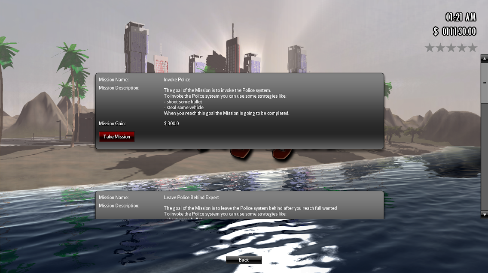</td>
        <td>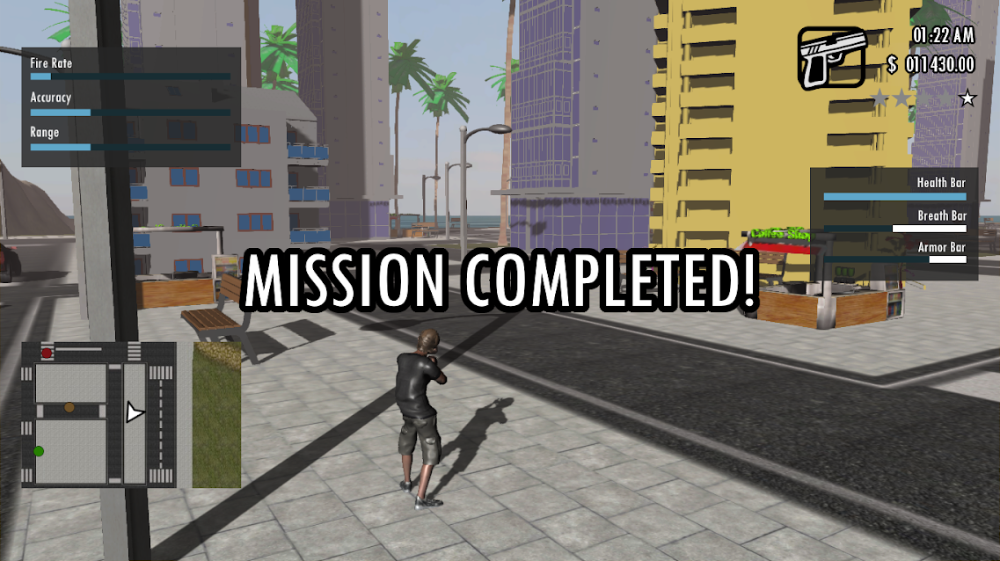</td>
    </tr>
</table>

### Mission Development via Java Reflection
To allow for a wide selection of available missions and their dynamic definition, a powerful language feature is employed: the **Java Reflection**. The various missions will therefore be developed by *external* developers with respect to the application, ensuring an unlimited availability.
The system offers several interfaces necessary for communicating with the *logic-core* of the game. These interfaces will be exported to a single `jar` archive that external developers will need to import in order to implement such interfaces.
Each implemented mission (or group of missions) will then be exported to a second `jar` archive, containing the set of classes defining the developed missions, provided to the *logic-core* of the game and analyzed at **runtime** using the Java Reflection. Each new mission will then be instantiated as a mission prototype and displayed to the user.

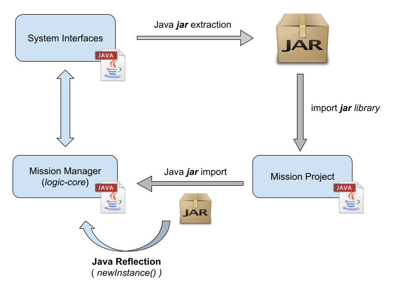

Interfaces and classes in the **System Interfaces** `jar`:
* `IMission`
* `ILogger`
* `ILoggingEvent`
* `MissionEventLogger`
* Auxiliary classes for implementing events (implements `ILoggingEvent`):
    * `AircraftLoggingEvent`
    * `VehicleLoggingEvent`
    * `WantedStarsLoggingEvent`
    * ...


## Logging
The mission system and its development are based on a **logging system** made available to the *logic-core* of the game. Appropriate interfaces are dedicated to identify and interact with relevant gameplay events through a dedicated logger. For example, a `MissionLogger` is used to record the events required for the various mission implementations.


## Game Map
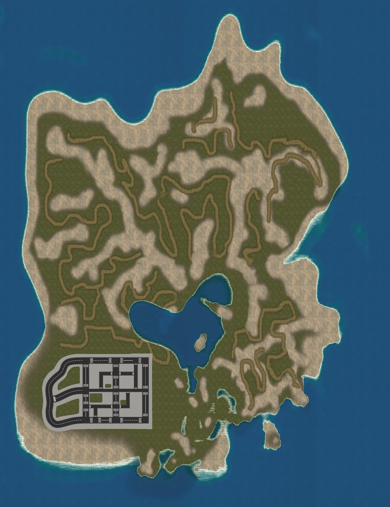